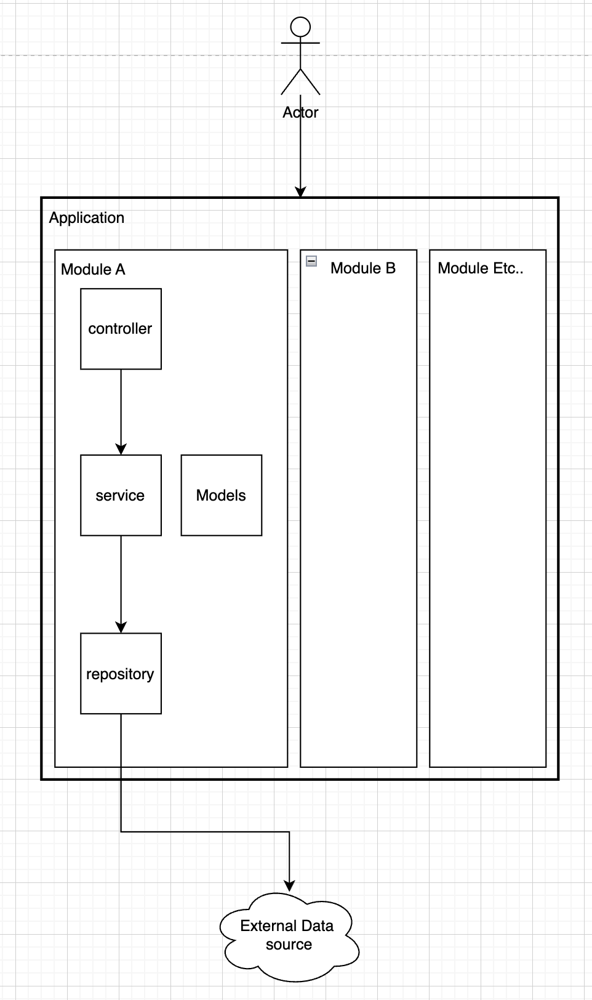

# Intro

You will find in this README.md file a high level description of the solution and the trade-offs made to stay within reasonable time of the 5h exercise duration.

For more details on using the API and the CLI consult the README.md files found in their respective package folders

# Quick start steps:

Before diving into more details here are the quick start steps that should get you up and running

- from the project root
- run `nvm use` to make sure you are using the correct node version for this project. If you don't have nvm installed follow the [installation instructions](https://github.com/nvm-sh/nvm) on the package repository
- run `pnpm install` to install packages
- run `pnpm api start:dev` to start the API and wait for it to be available at localhost:3000
- run `pnpm cli start --country=<FR,ES,IT,DE,AT>` to query ongoing trials for any of the countries avaialbe (example usage: `pnpm cli start --country=FR`)

# Running tests
- run `pnpm api test` to run API unit test
- run `pnpm api test:integration` to run API integration test
- run `pnpm cli test` to run CLI unit tests


# Overall architecure

You fill find that the 2 main packages (api and cli) are both following the same application architecture overall where only the implementation details differ.

Let's start with this representative diagram and you will find additional details bellow



### Models
> Define the core concepts and relations existing in our applications

### Controllers
> Are responsible for processing input. For the API this can be processing requests made for certain endpoints and for the CLI is can be processing command (and arguments) inputs

### Services
> Define business logic related to a domain.

### Repositories
> Provide an abstraction layer for accessing data sources such as a database, api, or in our case, json files

### Modules
> Modules represent domains and they encompass the related object while dividing the application in larger significant areas focused on a certain problem. One example of such module is the trials module found under `/packages/api/src/trials`

Moreover, you may have noticed the usage of other structures such as:
- Enums: for defining typed constants
- Interfaces: for typing objects coming from external sources
- Mappers: for mapping objects to defined types in our application

These structures represent more technical implementation details an have been used to better structure the resulting solution where needed.

# Technology choices

### For the API
For the API the [Nest.JS](https://nestjs.com/) framework was chosen because it provides a boost in productivity due to it's set of relevant features for this technical test such as:
- Typescript
- Dependency injection
- Testing utilities
- Opinionated structure
- Endpoint definition and validation
- CLI with code autogeneration capabilities

### For the CLI
The default setup that used [commander](https://www.npmjs.com/package/commander) was kept because it already provided an intuitive way to define and validate the CLI options to be provided. On top of that [jest](https://jestjs.io/fr/) was added to bring support for unit and integration testing.

# Time constraints

In order to remain withint the 5 hour time constraint of the exercises the solution focuses on meeting the exercise requirement rather that being production ready. 

With this being said here are the trade-offs made to stay withing the given time frame
- No extra features outsite the requirements, exception out of the box extra features provided by the chosen technologies
- No e2e tests that start the api and run the cli to fully validate the integrations
- No running environment configuration
- No integration tests for the CLI
- No CI/CD support
- No focus on application performance
- No build size optimisation
- No authentication/authorisation
- No customisation of development environemnt for productivity or catching errors faster

# Original Test description

<details>

<summary>View technical test description</summary>

<br>

# Context
As a senior product engineer in the team, you suggested to build an internal tool for our customer success team. You agreed with the product team on the following milestones.

## Step 1: Web API

We first need to be able to query the list of ongoing clinical trials. Two fields are available for queries:
* Sponsor name
* Country code

We already have access to a third-party API (represented by [this file](trials.json)) listing all clinical trials, and we are going to build a wrapper around it.

A trial is _ongoing_ if:

- its start date is in the past
- its end date is in the future
- it has not been canceled

Here is the payload you should obtain when querying ongoing clinical trials for the sponsor "Sanofi":

```json
[
  {
    "name": "Olaparib + Sapacitabine in BRCA Mutant Breast Cancer",
    "start_date": "2019-01-01",
    "end_date": "2025-08-01",
    "sponsor": "Sanofi"
  },
  {
    "name": "Topical Calcipotriene Treatment for Breast Cancer Immunoprevention",
    "start_date": "2018-03-20",
    "end_date": "2032-09-10",
    "sponsor": "Sanofi"
  }
]
```

Example stack: http server exposing REST endpoint that serves json payloads.

## Step 2: Command-line interface

We will then build a command-line interface that displays the list of ongoing clinical trials for a given country code. It will be deployed on the computers of the customer success team. We already have access to a [file](countries.json) that maps country codes to country names. We will leverage what we have already built in the previous step.

Here is the output you should get for the country code "FR":

```txt
Olaparib + Sapacitabine in BRCA Mutant Breast Cancer, France
Topical Calcipotriene Treatment for Breast Cancer Immunoprevention, France
```

# Instructions

- [ ] Clone this repository (do **not** fork it)
- [ ] Implement the features step-by-step (your commit history should be clear to follow)
- [ ] Document your architecture and design choices along the way
- [ ] Provide instructions on how we can run your code
- [ ] Publish it on GitHub (or equivalent)
- [ ] Send us the link and tell us approximately how much time you spent on this assignment

## Guidelines

We expect you to spend no more than 5 hours on this assignment.

To get you started quicker, we setup a typescript monorepo with an API and a CLI. Feel free to use other languages and technologies you are more comfortable with. You are encouraged to make good use of open-source code.

## Expectations
- [ ] You followed the instructions 
- [ ] We can run & query the Web API
- [ ] We can run the CLI
- [ ] We can run tests
- [ ] The applications are bug free

## Out of scope

- Authentication / authorization
- Usage of third party tools, like a CI service
- Performance
- Security

# Setup instructions

In order to setup and run the existing basic project we provided:
- install node (see .nvmrc)
- install and run `pnpm install`
- see the documentation in packages/api and packages/cli
</details>